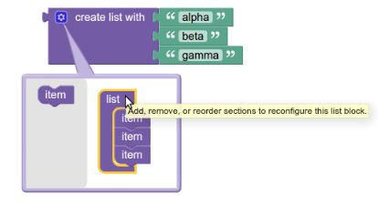
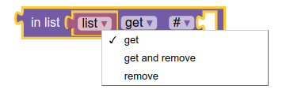
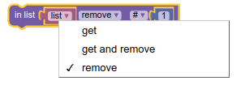
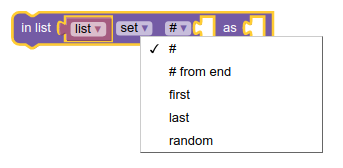

# لیست
پازل های لیست مجموعه ای از آیتم های سفارش داده شده هستند مثل لیست "to do " یا لیست خرید .
آیتم های داخل این لیست ها می توانند از هر نوعی باشند و مقدارهای یکسان ممکن است بیشتر از یکبار در لیست ظاهر شوند.

# ساخت لیست

## ساخت لیست خالی
ساده ترین لیست، لیست خالی می باشد که از پازل **create empty list** ساخته می شود

## ساخت لیست با
### کاربردهای ابتدایی
پازل **create list with** به کاربر اجازه میدهد که در یک لیست جدید مقدار ابتدایی بدهد.
در این مثال لیستی از کلمات ساخته شده و در متغیری به نام letters ریخته شده است:

اینجا لیست "letters" را اینگونه تعریف می کنیم ["alpha", "beta", "gamma"] پایین به متغیر های که در این بخش تعریف شده اند اشاره می کنیم.

این ساخت لیستی از اعداد را نشان میدهد.

### تغییر تعداد ورودی ها
برای تغییر تعداد ورودی ها، روی ایکون چرخ دهنده کلیک کنید.این کار یک پنجره ی جدید باز میکند:

سپس شما میتوانید با کشیدن پازل ها در پنجره ی باز شونده ورودی ها را اضافه یا حذف کنید مانند نمونه

در حالی که در این مثال به انتهای آن اضافه شد، هر جایی می تواند اضافه شود. به طور مشابه item های اضافی را می توان به بیرون از پازل if کشید.

## ساخت لیست با item

پازل **create list with item** به شما اجازه این را میدهد که لیستی که تعداد مشخصی کپی از item را دارد. به عنوان مثال، پازل های زیر متغیر words را به عنوان لیستی تعریف می کند که اعضای آن ["very", "very", "very"] هستند.

# بررسی کردن طول یک لیست

## خالی
مقدار پازل **is empty** درست است اگر ورودی آن لیست خالی باشد در غیر این صورت غلط است.
مقدار پازل زیر برابر غلط است چون متغیر colours خالی نیست و سه عضو دارد.

توجه کنید به شباهتش به پازل[ "is empty" ](http://puzlime.com/wiki/text.md)برای قسمت متن

## طول
پازل **length of** تعداد آیتم های داخل لیست که به صورت ورودی استفاده میشوند را میدهد.
برای مثال مقدار پازل های زیر برابر 3 می باشد چون متغیر رنگ سه آیتم دارد.

توجه کنید که ابن پازل تعداد ایتم های موجود در لیست را میدهد نه تعداد ایتم های متفاوت در لیست.
برای مثال در زیر مقدار داده شده برابر 3 میباشد حتی اگر کلمه ها شامل لیست (["very", "very", "very"])

توجه کنید که شبیه پازل  ["length of"](http://puzlime.com/wiki/text.md) برای متن میباشد.

# پیدا کردن ایتم ها در لیست

این پازل ها  موقعیت یک ایتم در لیست را پیدا میکنند.در مثال زیر اولین  "very"  در خانه ی اول قرار دارد چون ابتدای لیست با "very"  شروع شده است.

 در مثال دیگر مقدار اخرین "very" در خانه ی سوم قرار دارد

 اگر ایتم در لیست وجود نداشته باشد نتیجه صفر می شود مانند مثال زیر

 این پازل ها شبیه پازل های [the ones for finding letters](http://puzlime.com/wiki/text.md) در متن می باشد.
 
# گرفتن ایتم ها از لیست 
 
## گرفتن یک ایتم از لیست
 
 دوباره لیستی از رنگ ها را تعریف میکنیم:

 
 پازل زیر به شما رنگ ابی را میدهد  چون دومین ایتم در لیست میابشد.(شمارش از ابتدای سمت چپ می باشد)

 
 این مثال به شما سبز را میدهد به عنوان دومین ایتم از اخر سمت راست

 
 اولین ایتم قرمز را میدهد.

اخرین ایتم زرد را میدهد.
 

 
 به صورت تصادفی یک ایتم از لیست را بخواهیم یکی از رنگ های قرمز، ابی، سبز، زرد را به شما میدهد.
 

 
## گرفتن و حذف کردن ایتم

A dropdown menu on the in list ... get block changes it to in list ... get and remove, which provides the same otuput but also modifies the original list:

This example sets the variable first letter to "alpha" and leaves letters as: ["beta", "gamma"].

## حذف ایتم
Selecting "remove" on the dropdown causes the plug on the left of the block to disappear:

این کار اولین ایتم از لیست را حذف میکند.

## گرفتن زیر ارایه
پازل **in list ... get sublist** شبیه پازل **in list ... get** می باشد به جز استخراج زیرارایه نسبت به ایتم های تکی .
انتخاب های مختلفی وجود دارد برای شروع و پایان یک زیرارایه که قابل تعیین می باشد.

در این مثال لیست **first letters** را میسازیم. این لیست جدید دو عنصر دارد
["alpha", "beta"]

توجه کنید که این پازل لیست اصلی را اصلاح نمیکند.

# اضافه کردن ایتم به لیست
## in list ... set
در پازل **in list ... set**ایتم در جای خاصی از لیست با ایتم متفاوتی عوض می شود.

برای فهمیدن هر یک از گزینه های دراپ دان قسمت قبل را ببینید.

در مثال پایین داریم:
لیست کلمات با سه ایتم ساخته شده است ["very", "very", "very"]
ایتم سوم ان با "good" جابه جا میشود
مقدار جدید لیست کلمات برابر است با ["very", "very", "good"].

# in list ... insert at
 پازل **in list ... insert at** را با استفاده از دراپ دان منوی پازل **in list ... set** میتوانید بیاورید.
 

 
 این پازل ایتم جدیدی را در جای مشخصی قبل از ایتمی که هست میگذارد.
 در مثال زیر داریم :
 1- لیست کلمات با سه ایتم ["very", "very", "very"] ساخته می شود.
 2- سومین ایتم ان با "good" عوض می شود.مقدار جدید لیست برابر است با "very", "very", "good"].
 3- کلمه ی "you're"در شروع لیست قرار میدهیم. مقدار نهایی لیست برابر است با : ["You're", "very", "very", "good"].

 
# شکاندن رشته ها و چسباندن لیست ها

## ساختن لیست از متن
پازل **make list from text** متن داده شده را به تکه هایی میشکاند با استفاده از جدا کننده

در مثال بالا لیست شامل سه قسمت از متن می باشد."311", "555" و "2368".

## ساختن متن از روی لیست
 پازل **make text from list** با استفاده از جدا کننده یک متن میسازد.

 
 در مثال بالا متن جدید را با مقدار "311-555-2368" برمیگرداند.
 
